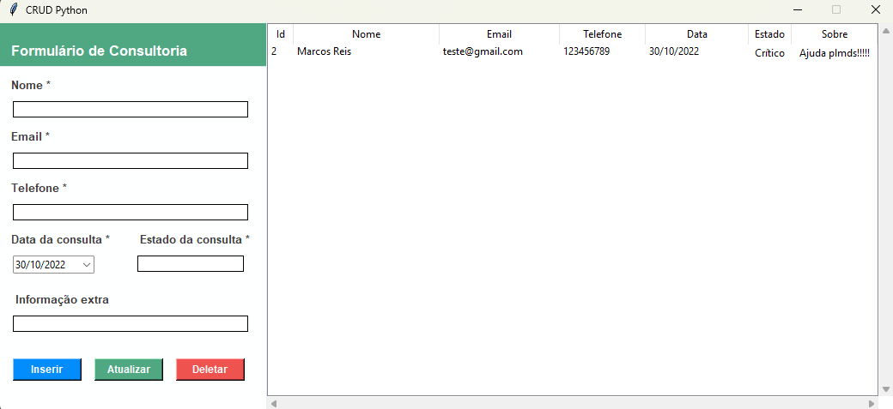

# Formulário de Consultoria
Criação de Cadastro de consultas utilizando Tkinder e SQLite.

## Tecnologias Utilizadas
- ``Python``
- ``Tkinter``
- ``SQLite``

## Autor

| [ Marcos Reis Dutra](https://github.com/Marqueba)
